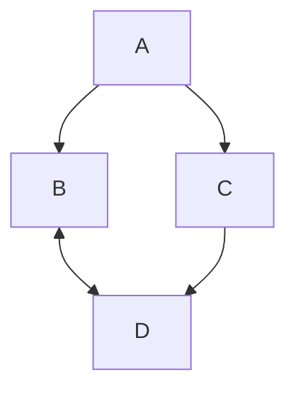

# MERMAID charts on streamlit

`mermaid` is a lightweight tool for creating visualizations such as flowcharts and simple charts. See [here for the mermaid syntax](https://docs.mermaidchart.com/mermaid-oss/intro/syntax-reference.html).

## Objective

`mermaid` chart viewer and editor.

- Accepts input of a dataframe with the workflow, URLs, connector types
  - The dataframe template can be downloaded from the app.
  - The columns are `[From_ID, From_Label, To_ID, To_Label, Connector, Tooltip, URL, notes]`

## Options

1. Clone the repository and run it in Code Ocean or locally as a streamlit app.
2. Or generate mermaid plots by running a jupyter notebook/ jupyter lab IDE and using the `.ipynb` file as a template.
3. The mermaid-formatted text block and be copied from the app and pasted into a commercial tool such as [mermaid.live](mermaid.live) for some additional functions.
4. I took the streamlit app and fed it into claude Sonnet 4.5 to develop a pure `html` solution, which is demoed in [mermaid_interactive.html](./code/mermaid_interactive.html). 

## To-do

- Tooltips are not implemented
- node shape changes are not supported, except in manual edit mode
