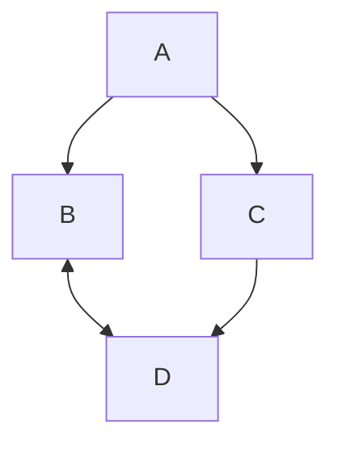

# MERMAID charts from CSV templates

**Zack Lewis, PhD**
_Allen Institute for Brain Science_

## Overview

`mermaid` is a lightweight tool for creating visualizations such as flowcharts and simple charts. See [here for the mermaid syntax](https://docs.mermaidchart.com/mermaid-oss/intro/syntax-reference.html).

`mermaid` charts are generated with a simple syntax, like follows:

```raw
graph TD;
    A-->B;
    A-->C;
    B<-->D;
    C-->D;
```

which yields:



## Objective

A. `mermaid` chart viewer and editor with input from a `.csv` file.
B. Generation of project landing pages incorporating the `mermaid` chart and project-specific links and documentation.
C. Support for links and notes in the `mermaid` chart. 


- Accepts input of a dataframe with the workflow, URLs, connector types
  - The dataframe template can be downloaded from the app.
  - The columns are `[From_ID, From_Label, To_ID, To_Label, Connector, Tooltip, URL, notes, From_Color, To_Color]`
  - **Semantics:** Each row represents a unique connection/edge. The `Tooltip`, `URL`, and `notes` are associated with the **target node** (`To_ID`). If the same node appears as a target multiple times, the first non-empty URL/tooltip is used. `To_Color` takes precedence over `From_Color` when both are present for the same node.

## Options

1. Clone the repository and run it in Code Ocean or locally as a `streamlit` app.
2. Or, generate mermaid plots by running a jupyter notebook/ jupyter lab IDE and using the `.ipynb` file as a template.
3. The mermaid-formatted text block and be copied from the app and pasted into a commercial tool such as [mermaid.live](mermaid.live) for some additional functions.
4. I took the `streamlit` app and fed it into claude Sonnet 4.5 to develop a pure `html` solution, which is demoed in [mermaid_interactive.html](./code/mermaid_interactive.html). I further developed it the claude version with new functions, visualizations, and export options. 
5. The `.html` solution includes two components. 
    
    **a**. The [mermaid_interactive.html](./code/mermaid_interactive.html) page will allow you to create a `mermaid` diagram from a `.csv` file, download templates for the `.csv`, make edits to the diagram, and export `mermaid` syntax for pasting into another editor. 
    
    **b**. The page also allows you to make a project landing page with the **Generate Landing Page** button. This creates a simple project home page that features the `mermaid` diagram you created and has space to put in links and documentation. 

## To-do

- Tooltips are not implemented in streamlit. They are in html
- Node shape changes are not supported, except in manual edit mode
- `SVG` download is not working well in html. The `.svg` files render okay (not perfectly) in inkscape, but poorly in Adobe Illustrator. 